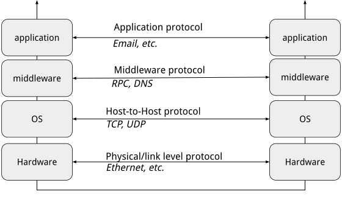
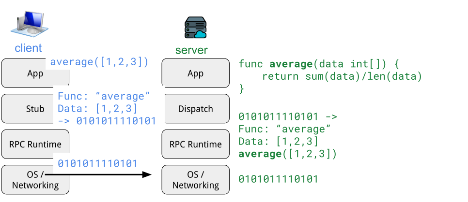

## Lecture 2: Communication Primitives

How do computers within a distributed system communicate with each other? 

We could imagine several schemes– we could connect all the computers directly via a wired connection. However, to do this we would need to make sure there is a physical connection between all computers in our system. Furthermore, we would have to consider the low-level logic for how to pass data over said wired connection. Perhaps we could instead leverage the internet– directly send bytes from one computer to another over the largest, most popular computer network, with a protocol like TCP. Or, perhaps we could use HTTP GET/POST requests to send text data or jsons across the internet. 

The world of **computer networking** has solved many of these problems for us. The question becomes, what is the best communication primitive for our use case in distributed computing?

### Background: The World of Computer Networking

**The network stack** describes the layers of networking technology that back communication protocols.  



The **physical layer** is the hardware of the computer network (direct wired connections). The **network layer** describes how to navigate the connection of switches, wires, etc from one end point to another. Internet protocol (using IP addressing) for example tells us how to identify endpoints and navigate the network. **Transport layer** protocols describe how two or more computers can coordinate to send/recieve bytes of data. **TCP protocol** handles establishing a connection, maintaining **in- order delivery** of messages, and guaranteed (retry) delivery. On top of that an application layer protocol like **HTTP** handles not only sending bytes of data but instead text / multipart form data.

### Why Distribute Computation?

Why might a developer wish to distribute computation?

* Client application can offload the execution of expensive functions to powerful servers   
* Function may belong to a third-party service (proprietary application) and there is no option to run it locally   
* Modularity, better code organization, separation of concerns (main motivation for microservice architectures)   
* We can scale out a system by distributing computation tasks across different machines   
* Interoperability (between services), programming language independence, integration with ecosystem

### Example

Let’s say, for example, we have a simple flight booking system running within a client app. This client application (maybe run on a mobile device) orchestrates sending a query for available flights to a server hosting a **third-party** flight database, and then with the results, outsources a **computationally expensive** averaging function to display the average price of flights to the client.

The app client code may look like:

```golang
func main() {
 	prices := get_flight_prices() 	
    res := average(prices) 
} 
```

What would be ideal instead, is if these remote calls to the flight database or the averaging server looked, to the developer of the phone app, just like a local function. To achieve this, we can use **RPCS** as a communication primitive.

### Remote Procedure Calls

**Remote Procedure Calls (RPC)** are a mechanism for networked communication wherein a client calls a function, however the implementation or body of that function, is code that runs remotely on a different server.

How do RPCs work under the hood?

1. The RPC library stub generates message with parameters and procedure name and sends message over network to remote server  
2. The remote servers RPC library stub unpacks the parameters and procedure name to call correct server code  
3. Server code implementation runs on input parameters, passes result back to RPC library stub  
4. RPC library stub sends the result back over the network  
5. Receiving RPC library stub passes result back to calling client code



RPCs are built on top of some network communication protocol-- like TCP which handles the reliable and ordered delivery of messages.

To send data over the network, it must be in binary format. The process of taking a data type (an int variable holding the value 3, or a float variable holding the value 3.0, or a go struct containing several fields) is known as serialization. Before data is sent over the network it is **serialized** via an agreed upon algorithm, then upon receipt, the data is **deserialized** and interpreted. Serialization is also known as **data marshalling** and deserialization is known as **data unmarshalling.**

A major benefit of an RPC library is that it handles serialization of your program’s data types (either parameters or return values) for ease of use. 

```golang
func main() {
	client, err := rpc.Dial("tcp", "localhost:1234")
	if err != nil {
		log.Fatal("dialing:", err)
	}

	var prices []float64
	err = client.Call("FlightService.GetPrices", struct{}{}, &prices)
	if err != nil {
		log.Fatal("FlightService.GetPrices error:", err)
	}

	var avg float64
	err = client.Call("MathService.Average", prices, &avg)
	if err != nil {
		log.Fatal("MathService.Average error:", err)
	}
	fmt.Printf("Average: %.2f\n", avg)
}
```

*The implementation via RPCs requests.*

Another reason we elect to use RPCs in this course is **golang’s rpc library** net/rpc.

* See examples: [https://pkg.go.dev/net/rpc](https://pkg.go.dev/net/rpc) 

### Communication Failures

When communicating over the network, failures are common, if not inevitable. There are many ways failures may occur– the server you are talking to is crashed, slowed, or disconnected from the network. The network itself may drop packets or have a broken connection. 

But how do all these failures appear to the client? They all appear as **not receiving a response\!** 

What should the client do when they do not receive a response? The answer to this question depends on the goals of the execution of our request.

#### At Least Once Delivery

**At Least Once:** In an at least once system, if the client receives a response message to a request: then the request was delivered and executed at least one time (perhaps more than once)

**Implementation:** Have the client retry sending the request until it receives a success response from the server.

#### At Most Once Delivery

**At Most Once:** If the client receives a response message to a request: then it was delivered/executed exactly once.

**Implementation:** Have the server keep track of request IDs, ensure that requests are not re-preformed if the server receives a duplicate request ID. So now each message has a metadata as follows: (client, sequence number). The server has a map\[(client, sequence number)\]\[Result Object\]. If the server receives a request that already exists in the map, the server does not re-perform the operation and instead returns the saved old result form the map.

A problem with this approach is that, naively, the map will grow in size forever. Thus, it is necessary to perform some sort of optimization for space such as deleting entries in the map after the response has been acknowledged by the client.

**Idempotent:** a message or request is idempotent if the system state is agnostic to receiving duplicates of that request.

* f(x) \= f(f(x)) where f is the request and x is the system state.  
  * Requests that are idempotent mean that practically, we can re-run them and we do not need to worry about at-most once delivery bookkeeping.

#### Exactly Once

**Exactly Once Delivery:**  A system with exactly-once semantics ensures that requests are processed once and only once. 

However, in practice, with failures, we settle on the practicality– If the client receives a response message to a request: then it was delivered/executed exactly once, and it will block and not proceed until it receives this response.

**Note:** In practice exactly once semantics are impossible, as it is always technically possible a server or network connection fails forever, and we do not get exactly once execution. 

**Implementation:** combine At Most Once server semantics with at least once client retry scheme. 

## Data Races in RPC Servers

Consider the following simple RPC server, built on top of the go RPC library.

```golang
var messages []string

func (t MessageService) AddMessage(args *Args, reply *int) error {
	log.Println("Added a Message")
	messages = append(messages, args.Message)
	return nil
}

func (t MessageService) GetMessages(args *Args, reply *[]string) error {
	log.Println("Returning Messages", messages)
	*reply = messages
	return nil
}
```

Somehow, we find that if many clients call `AddMessage` concurrently, we lose messages!

What could be happening?

What is important to remember is that the go rpc library **automatically spawns a new goroutine per incoming RPC request**.

Thus, we must worry about **data races** in our RPC server.

Where is the data race in the above code? Consider that appending to a slice in go is not an **atomic** operation. **Atomic** in this case means it happens all at once in an unbreakable step. 

Instead, appending means reading the current value of the message slice, creating a new version with the additional element, and setting the message slice to the new slice.

Thus, consider the issue if the scheduler switches to another thread in-between this read of the old value of the slice and the write of the extended version:

|Thread 1 | Thread 2|
| --- | --- |
| `msgs = [ m1, m2, m3]` | |
| | `msgs = [ m1, m2, m3]` |
|`msgs = append msgs, m4 (msgs = [m1,m2,m3,m4])` | |
| | `msgs = append msgs, m5 (msgs = [m1,m2,m3,m5])`|

At the end of thread 2, we overwrite the append of m5!

Thus, to write the correct, data-race-free code, we must protect global data structures, like the message list with a lock!
