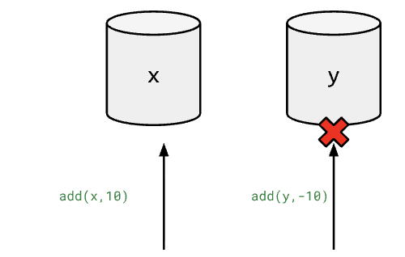

## Lecture 17: Transactions and 2PC

*Visuals by Vasiliki Kalavri and Anna Arpaci-Dusseau*

In our previous section on transactions, we discussed how **concurrency control** (OCC/PCC) can guarantee isolation of concurrent transactions.

Today, we will focus instead on a method to achieve **atomic** transactions.

### Atomicity

**Atomicity** describes the “all or nothing” property of writes in a transaction. Atomicity means that if a transaction fails, *all writes of that transaction fail.* If a transaction succeeds, *all writes of that transaction succeed.* 

If our transactions are atomic, applications can simply retry the entire transaction if it sees the transaction fail without worrying about undoing partial operations, etc.

The reason that atomicity can be difficult to achieve in a distributed setting is that different servers may be responsible for different parts of the transaction. Thus, we need a mechanism to communicate between these servers in order to determine if one part of the transaction may have failed to commit.

Consider the following example.

| TXNs |  |
| :---- | ----- |
| <code>To&nbsp;start:&nbsp;x=100,&nbsp;y=100&nbsp;   T1:   BEGIN TXN    add(x, 10\)    add(y, \-10)    END TXN     After T1 executes:  x=110, y=100.</code> | This would mean that T1 was not atomic. We observed a partial write– the x+=10, however, the operation y-=10 is not observed. Naively, with distributed transactions, such a behavior could occur if we have a sharded database and `x` resides in one server, `y` in another, only one server experiences some failure and we have no mechanism to recognize this.   |

### Distributed Commit Protocol

A **distributed commit protocol** achieves atomicity for distributed transactions. The setting of a distributed commit protocol is the following:

1. We have many servers cooperating on a task– each doing their own part  
2. Each server has a different role and different data  
   1. Notably this is different from Raft or distributed consensus, where each server had the same data and role in the system.  
3. All servers must agree to **commit** or all servers must agree to **abort.**  
   1. If one server commits, and the others abort– this breaks the **atomicity** of our transaction\!  
   2. No server will make permanent changes to their database/state until all servers decide to commit.

A distributed commit is often facilitated by a **coordinator** which passes the verdict of whether to perform/commit the operation. The other servers are **participants** who perform data tasks and are given the verdict.

In practice, we may find that part of a transaction may not be possible to perform on one of the participants. For example, a participant may fail to acquire necessary locks, or fail in some other application-level way. In this case, we need to ensure that the other participants do not **commit** their operation.

Consider the following naive approach:

1. A coordinator sends a single message– broadcast decision of abort/commit to all participants   
   1. However, with this single message, a coordinator has no way of knowing if each participant would be able to commit. As mentioned above, certain participants may not be able to perform their portion of the transaction.

We see that a single messaging step is not enough to get the requisite information about the state of the system. This reasoning brings us to explore if a ***two phase protocol*** could be used instead.

### Two Phase Commit

**Roles in 2PC:**

* **Coordinator:** Oftentimes we have the client act as the transaction coordinator.  
* **Participant:** Servers performing the operations to their state.

**Before 2PC:** The transaction is staged on all participants. The client sends relevant **operations** to all participants. The participant may make temporary changes to some local state (but no permanent writes to the database will occur/be made visible until the “commit” decision is made).

**Phase 1a:** Coordinator sends PREPARE to participants  
**Phase 1b:** When a participant receives PREPARE it returns vote-commit or vote-abort. 

* In this step we may check if our transaction can acquire all necessary locks, or if there are any other sort of application-level failure. If there is some issue that would prevent committing, `vote-abort`.  
* If we vote to abort, we may release any held locks.

**Phase 2a:** Coordinator collects all votes. If the coordinator receives all `vote-commits` from all participants, it decides to `COMMIT`, otherwise it will `ABORT`.  
**Phase 2b:** When a participant receives a `COMMIT` message it makes permanent changes to its state. After which, it may release any held locks. If a participant receives an `ABORT` message, it discards any temporary changes and makes no changes to its state. It also releases any held locks after this point.

### Goals of 2PC

Now that we understand the basic protocol– consider, what is the goal of 2PC?

 Primarily, our goal is **correctness.** In the setting of 2PC this means agreeing on the commit/abort decision across all participants. If we fail in this goal, our transaction may not be **atomic** and we will see partial writes of our transaction.

Secondarily, our goal is **performance.** We want to minimize aborting a transaction if not necessary, committing most of the time. Given that we can correctly decide to commit/abort, we want to do so in a timely manner. We also want to reduce the amount of time that a participant is holding a lock. Remember, if a participant holds a lock, they also prevent other transactions in the system from occurring\!

### 2PC with Failures

What happens when we see server failures or network failures in two phase commit? We will primarily consider transient failures, where our goal afterwards is to resume correct operation and recover.

What is the symptom of failure in 2PC? **There is only one:** the coordinator or a participant will experience a **timeout** when expecting a message in one of the phases.

Let’s consider the four cases in which we may witness a timeout in 2PC and the action we may take.

| Case | Action |
| :---- | :---- |
| TC timeout waiting for yes/no vote(s) from participant | **Abort.**  This is safe, as we have not told any server to commit. This is performant, as after we decide, the system can progress. |
| Participant timeout while waiting for a `prepare` message from TC. | **Abort**.  This decision is safe, as we can vote no if contacted in future about this transaction and we can be sure that the transaction will not be committed.  This is performant because after we vote no, we can release held locks. |
| Participant timeout for commit/abort after voting no | **Abort.**  This decision is safe as we know because we voted no, this transaction will never be committed. |
| Participant timeout for commit/abort after voting yes  | **BLOCK\!**   This is the only safe decision, because the participant can’t be sure of either a COMMIT or ABORT result.  In the case that all other participants voted yes, it may be that transaction will be/was committed. Other participant servers may have received this `COMMIT` from the TC and made permanent changes to their state. However, it is also possible that another participant voted no and the transaction was aborted. In this case, if we committed, we would break atomicity. Thus, neither action is safe, so we must block until we eventually hear the verdict after recovery, even though this is not **performant.** |

This last case, where we experience **indefinite blocking** while holding locks is the main downside of the 2PC protocol.

### Persistence in 2PC

Consider that in the face of failure and later recovery, we must also guarantee correct behavior. 

How can we ensure correctness after recovery? We must store critical information in **persistent storage** on the TC and in the participant. 

What must the participant persist?

* Any previous votes sent over the network

What must the TC persist?

* Any previous commit/abort decision.

In the case of a failure and then subsequent recovery, this will allow the TC to re-query participants for their previous votes. Furthermore, participants can also re-query the TC on recovery to get transaction verdicts they may have missed.

### 2PC in Conclusion

Because of the slowness of the networked communication steps, the indefinite blocking, and the property that participants must hold locks during prepare and commit phases, 2PC has a bit of a bad reputation in the distributed systems world.

Systems which employ 2PC must justify why it does not harm their systems performance in the face of failure– we will see an example of a system that does just that in Google’s *Spanner.*